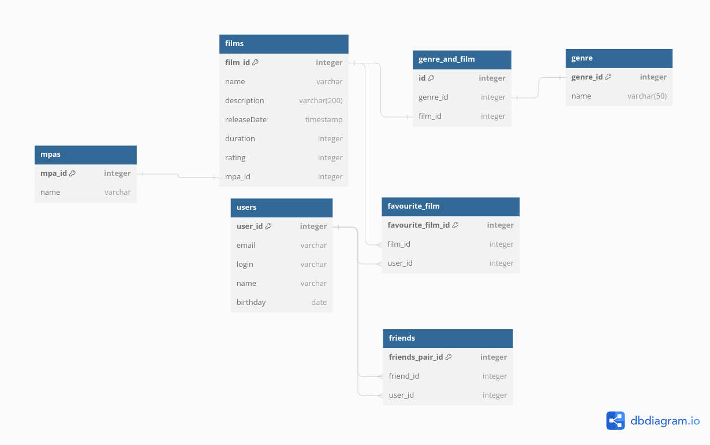

# java-filmorate

Добро пожаловать в репозиторий проекта java-filmorate!



Данное приложние умеет:

**1.Добавлять, удалять, обновлять друзей**

**2.Добавлять, удалять, обновлять фильмы**

**3.Ставить лайк фильмам**

**4.Выдавать ТОП-фильмов в зависимости от желаемого количества пользователя**

```
 SELECT f.film_id,
        f.name
 FROM films AS f
 INNER JOIN favourite_film AS ff ON f.film_id = ff.film_id
 GROUP BY f.name
 LIMIT 10
```

**5.Добавлять друг друга в друзья**

**6.Выводить общих друзей пользователей**

Таблицы:

1.films - хранит в себе информацию о айди фильмах(Первичный ключ), их названии, описании, дате релиза, продолжительности
и айди рейтинга.

2.genre_and_film - хранит информацию об айди фильма и об айди жанра, имеет первичный ключ id, связана с таблицей films
через Внешний ключ film_id и с таблицей genre через Внешний ключ genre_id

3.genre - хранит информацию о названии жанра, его описании, имеет первичный ключ genre_id

4.rating - хранит в себе название фильма и рейтинг, а так же первичный ключ rating_id связана с таблицей films

5.favourite_film - хранит в себе информацию о айди фильма и о айди юзера, который поставил лайк фильму, связана с
таблицами films через внешний ключ fil_id и с таблицей юзер через user_id

6.users - хранит информацию пользователе, его id(Первичный ключ), имя, логин, email, дату рождения

7.confirmed_invate - хранит информацию о пользователях, которые приняли приглашение в друзья, содержит айди друга и айди
юзера

8.unconfirmed_invate - хранит информацию о пользователях, которые приняли приглашение в друзья, содержит айди друга и
айди юзера


